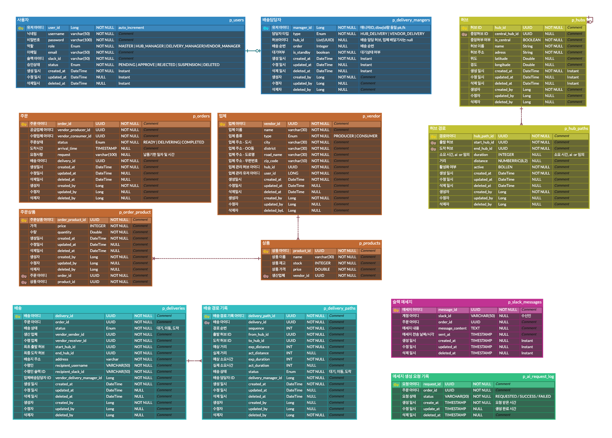
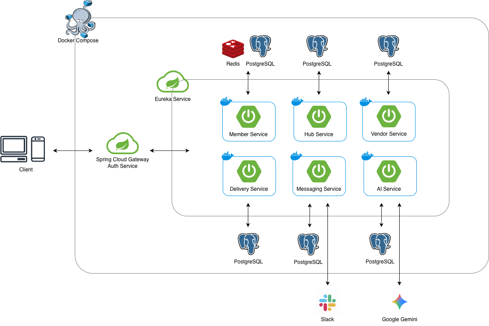

# FastLine
### 물류 관리 및 배송 시스템을 위한 MSA 기반 플랫폼 개발

## Project Objective

> 물류 관리 및 배송 시스템을 MSA(Microservices Architecture) 기반으로 설계·구현하여   
> 서비스 간 데이터 연동과 통신 구조를 이해하고 안정적인 분산 환경을 구축하는 것을 목표로 합니다.   
> Spring Cloud와 Spring Boot를 활용해 서비스 간 협업, 데이터 무결성, API 관리 전략을 학습하며   
> Gemini API를 이용한 AI 기능 연동을 통해 실제 서비스에 AI를 적용하는 경험을 쌓습니다.

## Contributors
<!-- ALL-CONTRIBUTORS-LIST:START - Do not remove or modify this section -->
<!-- prettier-ignore-start -->
<!-- markdownlint-disable -->
<table>
  <tbody>
    <tr>
      <td align="center" valign="top" width="17%">
        <a href="https://github.com/seolbin01">
          <br />
          <b>박설빈</b>
        </a><br />
        <sub>팀장<br>delivery-service</sub>
      </td>
      <td align="center" valign="top" width="17%">
        <a href="https://github.com/minju26">
          <br />
          <b>김민주</b>
        </a><br />
        <sub>ai-service<br>messaging-service</sub>
      </td>
      <td align="center" valign="top" width="17%">
        <a href="https://github.com/wlsql852">
          <br />
          <b>김진비</b>
        </a><br />
        <sub>auth-service<br>gateway-service<br>eureka-service</sub>
      </td>
      <td align="center" valign="top" width="17%">
        <a href="https://github.com/newbee9507">
          <br />
          <b>조재희</b>
        </a><br />
        <sub>vendor-service</sub>
      </td>
      <td align="center" valign="top" width="17%">
        <a href="https://github.com/kingstree">
          <br />
          <b>한준희</b>
        </a><br />
        <sub>hub-service</sub>
      </td>
    </tr>
  </tbody>
</table>
<!-- markdownlint-restore -->
<!-- prettier-ignore-end -->
<!-- ALL-CONTRIBUTORS-LIST:END -->

## Project Architecture
### Tech Stack


### ERD


### System Architecture


## Project Structure
### 공통 & 인프라
```text
FastLine
├── 📂 common (공통 라이브러리)
│   └── src/main/java/com/fastline/common
│       ├── auditing       # TimeBaseEntity, ActorBaseEntity 등
│       ├── exception      # 전역 예외 처리 
│       ├── response       # API 공통 응답 규격 
│       └── security       # JWT 인증 필터, UserDetails 등 보안 관련
│
├── 📂 eureka-service
│   └── src/main/java/.../eurekaservice
│       ├── EurekaServiceApplication.java
│       └── security/SecurityConfig.java
│
└── 📂 gateway-service
    └── src/main/java/.../gatewayservice
        ├── GatewayServiceApplication.java
        └── config/FilterConfig.java
```
### 비지니스 서비스
```text
🤖 ai-service (AI 메시지 생성)
└── src/main/java/com/fastline/aiservice
    ├── application     # AiService (AI 요청 처리)
    ├── domain          # RequestLog (요청 기록 Entity)
    ├── infrastructure  # GeminiClient (구글 Gemini 연동)
    └── presentation    # AiController

👤 auth-service (회원)
└── src/main/java/com/fastline/authservice
    ├── application     # Auth, User, DeliveryManager Service
    ├── domain          # User, DeliveryManager (Entity)
    ├── infrastructure  # HubClient, SecurityConfig
    └── presentation    # Controller

🚚 delivery-service (배송 관리)
└── src/main/java/com/fastline/deliveryservice
    ├── application     # DeliveryService (배송 관리)
    ├── domain          # Delivery, DeliveryPath (Entity)
    ├── infrastructure  # DB, FeignClient
    └── presentation    # DeliveryController

📦 hub-service (허브 & 경로 관리)
└── src/main/java/com/fastline/hubservice
    ├── application     # HubService (허브 관리)
    ├── domain          # Hub, HubPath (Entity)
    ├── infrastructure  # DB, FeignClient
    └── presentation    # HubController, HubPathController

💬 messaging-service (슬랙 알림)
└── src/main/java/com/fastline/messagingservice
    ├── application     # SlackMessageService (메시지 처리)
    ├── domain          # SlackMessage (Entity)
    ├── infrastructure  # SlackWebhookClient (슬랙 연동)
    └── presentation    # SlackMessageController

🏪 vendor-service (주문 & 업체 관리)
└── src/main/java/com/fastline/vendorservice
    ├── application     # Vendor, Product, Order Service
    ├── domain          # Vendor, Product, Order (Entity)
    ├── infrastructure  # DB, FeignClient
    └── presentation    # OrderController, VendorController
```
## Service Setup & Execution
### Development Environment
- Java 17
- Spring Boot 3.x

###  Execution
